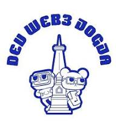

<div align="center">
  

  # Malgist

  ### AI-Powered DeFi Portfolio Management

  *Making DeFi investing simple, intelligent, and accessible for everyone*

  [](https://opensource.org/licenses/MIT)
  [](https://nextjs.org/)
  [](https://www.typescriptlang.org/)
  [](https://tailwindcss.com/)

  [Live Demo](https://malgist.vercel.app) • [Documentation](#) • [Twitter](#) • [Discord](#)

</div>

---

## 🌟 What is Malgist?

**Malgist** is an AI-powered, non-custodial DeFi portfolio management platform that helps users design, track, and optimize yield strategies across multiple protocols—effortlessly and securely.

We're not just another dashboard. We're your **AI companion** that sits on top of DeFi protocols, transforming complex DeFi investing into simple, actionable decisions.

### The Problem We Solve

DeFi is powerful but overwhelming:
- 🔀 **Fragmented ecosystem** - Managing yields across Aave, Lido, Compound requires jumping between apps
- 📊 **Complex monitoring** - Tracking positions, comparing APYs, and rebalancing needs constant attention
- 🧠 **Technical barriers** - Deep protocol knowledge required to optimize strategies
- ⏰ **Time-intensive** - Manual portfolio management is exhausting

### Our Solution

Malgist makes DeFi accessible through:
- 🤖 **AI Strategy Builder** - Answer simple questions, get personalized DeFi strategies
- 📈 **Smart Rebalancing** - AI monitors 24/7 and suggests optimal portfolio adjustments
- 🎯 **Unified Dashboard** - All your DeFi positions in one place (Aave, Lido, Compound, and more)
- 🔒 **Non-Custodial** - Your keys, your crypto. We never hold your funds.

---

## ✨ Key Features

### 🧠 AI-Powered Intelligence
- **Intelligent Strategy Design** - AI creates personalized allocation strategies based on your goals and risk tolerance
- **24/7 Portfolio Monitoring** - Real-time analysis of market conditions and portfolio performance
- **Smart Rebalancing Recommendations** - AI suggests optimal rebalancing based on market signals

### 🎯 Multi-Protocol Aggregation
- **Unified Interface** - Manage positions across Aave, Lido, Compound, Yearn, and Convex in one dashboard
- **Cross-Protocol Analytics** - Compare yields and opportunities across all supported protocols
- **Seamless Asset Allocation** - Distribute assets across protocols with simple drag-and-drop

### 🔒 Security First
- **Non-Custodial Architecture** - All transactions execute directly from your wallet via RainbowKit
- **No Private Key Storage** - We never have access to your funds
- **Smart Wallet Integration** - Session keys for enhanced security and UX

### 📊 Advanced Analytics
- **Real-Time Performance Tracking** - Monitor actual vs target allocations
- **Yield Optimization** - AI highlights best opportunities across protocols
- **PDF Reports** - Monthly performance summaries and insights

---

## 🚀 Quick Start

### Prerequisites

- Node.js 18+ and npm/yarn/pnpm
- A Web3 wallet (MetaMask, Rainbow, etc.)

### Installation

```bash
# Clone the repository
git clone https://github.com/yourusername/malgist.git

# Navigate to project directory
cd malgist

# Install dependencies
npm install

# Run development server
npm run dev
```

Open [http://localhost:3000](http://localhost:3000) to see the application.

### Environment Setup

Create a `.env.local` file in the root directory:

```env
# RainbowKit / WalletConnect
NEXT_PUBLIC_WALLET_CONNECT_PROJECT_ID=your_project_id

# API Keys (if needed)
NEXT_PUBLIC_ALCHEMY_API_KEY=your_alchemy_key
```

---

## 🏗️ Tech Stack

### Frontend
- **Next.js 14** - React framework with App Router
- **TypeScript** - Type-safe development
- **Tailwind CSS** - Utility-first styling
- **Framer Motion** - Smooth animations
- **GSAP** - Advanced interactive animations

### Web3 Integration
- **RainbowKit** - Wallet connection
- **Wagmi** - React Hooks for Ethereum
- **Viem** - TypeScript Ethereum library

### UI Components
- **Custom Components** - Tailored for DeFi UX
- **Responsive Design** - Mobile-first approach
- **Dark/Light Themes** - User preference support

---

## 📂 Project Structure

```
malgist/
├── app/
│   ├── components/
│   │   ├── Hero.tsx           # Landing hero section
│   │   ├── Features.tsx       # Key features showcase
│   │   ├── Definition.tsx     # Problem/solution cards
│   │   ├── Closing.tsx        # Analytics showcase
│   │   ├── BackedBy.tsx       # Investors/partners
│   │   ├── FooterBanner.tsx   # CTA section
│   │   ├── DotGrid.tsx        # Interactive background
│   │   └── ui/
│   │       ├── Navbar.tsx     # Navigation bar
│   │       └── Footer.tsx     # Footer component
│   ├── layout.tsx             # Root layout
│   ├── page.tsx               # Homepage
│   └── globals.css            # Global styles
├── public/                    # Static assets
├── lib/                       # Utilities and helpers
└── package.json
```

---

## 🎨 Design System & Visual Language

### Color Palette Philosophy

Our design system leverages a sophisticated **monochromatic grayscale palette** with strategic accent colors, creating a professional, trustworthy DeFi interface that prioritizes clarity and user focus.

#### Primary Colors
- **Background**: `oklch(1 0 0)` - Pure white (#FFFFFF) for maximum clarity
- **Foreground**: `oklch(0.145 0 0)` - Deep charcoal (#151816) for strong contrast
- **Primary**: `oklch(0.205 0 0)` - Rich black (#151816) for CTAs and emphasis
- **Secondary**: `oklch(0.97 0 0)` - Soft gray (gray-50) for subtle backgrounds

#### Neutral Scale
- **gray-50**: Light backgrounds and subtle sections
- **gray-100**: Card backgrounds and hover states
- **gray-200**: Borders and dividers
- **gray-600**: Secondary text and descriptions
- **gray-900**: Body text and headings

#### Semantic Colors (OKLCH Color Space)
- **Destructive**: `oklch(0.577 0.245 27.325)` - Error states
- **Chart Colors**: 5 distinct OKLCH values for data visualization
- **Border/Input**: `oklch(0.922 0 0)` - Subtle UI elements

#### Why OKLCH?
We use the **OKLCH color space** instead of traditional HEX/RGB for:
- **Perceptual uniformity** - Colors appear equally bright to the human eye
- **Better interpolation** - Smooth gradients and transitions
- **Accessibility** - Easier to maintain WCAG contrast ratios
- **Future-proof** - Native CSS support in modern browsers

### Dark Mode Support
Our design system includes a complete dark theme implementation:
- **Background**: `oklch(0.145 0 0)` - Deep charcoal
- **Foreground**: `oklch(0.985 0 0)` - Off-white
- **Card**: `oklch(0.205 0 0)` - Elevated surfaces
- **Borders**: `oklch(1 0 0 / 10%)` - Subtle transparency-based dividers

---

## ✨ Animation & Interaction Design

### Animation Framework

We combine **Framer Motion** and **GSAP** to create fluid, purposeful animations that enhance UX without overwhelming users.

#### Framer Motion (Declarative Animations)
Used for:
- **Page entrance animations** - Staggered fade-in effects
- **Scroll-triggered reveals** - `whileInView` for progressive disclosure
- **Hover states** - Smooth scale and shadow transitions
- **Micro-interactions** - Button presses, badge pulses

**Example Patterns:**
```tsx
// Fade-in from bottom (200ms delay)
initial={{ opacity: 0, y: 20 }}
animate={{ opacity: 1, y: 0 }}
transition={{ duration: 0.6, delay: 0.2 }}

// Infinite pulse animation
animate={{ y: [0, 8, 0] }}
transition={{ duration: 1.5, repeat: Infinity }}
```

#### GSAP (Advanced Physics-Based Animations)
Used for:
- **Interactive DotGrid background** - Real-time cursor tracking
- **Physics simulations** - Elastic returns and inertia
- **Complex sequences** - Chained animations with callbacks

**Key Techniques:**
- **Elastic easing**: `elastic.out(1, 0.75)` for playful, natural movement
- **Shockwave effects**: Radial displacement on click with falloff
- **Inertia-based motion**: Dots respond to cursor velocity and direction

### Animation Principles

#### 1. **Performance-First**
- **Hardware acceleration** - All animations use `transform` and `opacity`
- **Throttled events** - Mouse movements throttled to 50ms
- **Canvas-based rendering** - 60fps for 1000+ animated dots
- **RequestAnimationFrame** - Smooth, GPU-accelerated drawing

#### 2. **Purposeful Motion**
Every animation serves a function:
- **Fade-ins (0.6s)** - Draw attention to new content
- **Scale on hover (1.05x)** - Provide interactive feedback
- **Stagger delays (0.1s increments)** - Create visual rhythm
- **Elastic returns (0.8-1.5s)** - Communicate playfulness and polish

#### 3. **Accessibility Considerations**
- **Respects `prefers-reduced-motion`** - Critical for users with vestibular disorders
- **Non-essential animations** - Core functionality works without animations
- **Smooth easing curves** - No jarring or disorienting movements

### Interactive DotGrid Background

Our signature **DotGrid** component is a masterclass in interactive design:

#### Technical Specifications
- **Dot Size**: 2px with 15px gap spacing
- **Base Color**: `#d1d5db` (gray-300)
- **Active Color**: `#151816` (dark charcoal)
- **Proximity Threshold**: 80px - Dots change color near cursor
- **Speed Trigger**: 80px/s - Velocity detection for inertia
- **Shock Radius**: 250px - Click ripple effect range
- **Shock Strength**: 5x displacement multiplier

#### Interaction Mechanics
1. **Color Transition** - Smooth RGB interpolation based on cursor proximity
2. **Velocity Tracking** - Dots "pushed" by fast cursor movement (>80px/s)
3. **Click Shockwave** - Radial displacement with distance-based falloff
4. **Elastic Return** - Dots spring back to origin with `elastic.out` easing
5. **Inertia System** - Prevents re-triggering during animation

#### Performance Optimizations
- **Canvas API** - Hardware-accelerated 2D rendering
- **Path2D caching** - Circle shape reused for all dots
- **Throttled mouse events** - 50ms debounce for smooth performance
- **Device pixel ratio** - Sharp rendering on retina displays
- **ResizeObserver** - Efficient responsive grid recalculation

### Typography Motion
- **BlurText Component** - Letter-by-letter reveal with blur-to-focus effect
- **Stagger Animation**: 50ms delay per letter
- **Direction Control**: Top/bottom/left/right entrance
- **Use Case**: Hero headlines for dramatic first impression

### Transition Durations (UX Timing Standards)
- **Micro-interactions**: 0.3s - Button hovers, toggles
- **Content reveals**: 0.6s - Cards, sections entering viewport
- **Complex animations**: 0.8-1.5s - Elastic returns, physics simulations
- **Infinite loops**: 1.5s - Scroll indicators, pulse effects

---

## 🧑‍💻 Design Philosophy

### Minimalist & Professional
- Clean grayscale palette prioritizes content over decoration
- **85% white space** - Generous breathing room between sections
- **Type scale**: 16px base → 72px hero headlines (modular scale 1.25)
- Focus on content hierarchy and readability

### Web3-Native Experience
- Wallet-first interactions with RainbowKit integration
- Non-custodial emphasis in every design decision
- Trust indicators throughout the interface
- **Progressive disclosure** - Complexity revealed as needed

### Accessibility
- **WCAG 2.1 AA compliant** - Minimum 4.5:1 contrast ratios
- **Keyboard navigation** - Full tab-index support
- **Screen reader optimized** - Semantic HTML and ARIA labels
- **Motion preferences** - Respects `prefers-reduced-motion`

---

## 🤝 Contributing

We welcome contributions from the community! Here's how you can help:

1. **Fork the repository**
2. **Create a feature branch** (`git checkout -b feature/amazing-feature`)
3. **Commit your changes** (`git commit -m 'Add amazing feature'`)
4. **Push to the branch** (`git push origin feature/amazing-feature`)
5. **Open a Pull Request**

### Development Guidelines

- Follow TypeScript best practices
- Maintain consistent code style (Prettier + ESLint)
- Write meaningful commit messages
- Add tests for new features
- Update documentation as needed

---

## 🗺️ Roadmap

### Phase 1: Foundation (Current)
- [x] Landing page with AI positioning
- [x] Brand identity and messaging
- [x] Interactive UI components
- [ ] Wallet connection integration

### Phase 2: Core Features
- [ ] AI Strategy Builder interface
- [ ] Multi-protocol dashboard
- [ ] Real-time portfolio analytics
- [ ] Smart rebalancing engine

### Phase 3: Advanced Features
- [ ] AI-powered yield optimization
- [ ] Cross-chain support
- [ ] PDF reporting system
- [ ] Social features (share strategies)

### Phase 4: Scale
- [ ] Mobile app (React Native)
- [ ] Advanced AI models
- [ ] DAO governance
- [ ] Protocol partnerships

---

## 🏆 Backed By

<div align="center">
  
  &nbsp;&nbsp;&nbsp;
  
  &nbsp;&nbsp;&nbsp;
  
  &nbsp;&nbsp;&nbsp;
  
</div>

<div align="center">
  <em>Trusted by leading blockchain ecosystems and communities</em>
</div>

---

## 📄 License

This project is licensed under the MIT License - see the [LICENSE](LICENSE) file for details.

---

## 🔗 Links

- **Website**: [malgist.io](#)
- **Documentation**: [docs.malgist.io](#)
- **Twitter**: [@malgist](#)
- **Discord**: [Join our community](#)
- **Medium**: [Our Blog](#)

---

## 💬 Support

Need help? We're here for you:

- 📧 Email: support@malgist.io
- 💬 Discord: [Join our server](#)
- 🐦 Twitter: [@malgist](#)
- 📚 Docs: [docs.malgist.io](#)

---

## ⭐ Show Your Support

If you find Malgist useful, please consider:
- ⭐ Starring this repository
- 🐦 Following us on Twitter
- 💬 Joining our Discord community
- 🔄 Sharing with fellow DeFi enthusiasts

---

<div align="center">

  **Built with ❤️ by the Malgist Team**

  *Making DeFi investing simple and intelligent for everyone*

  [Get Started](#-quick-start) • [Join Discord](#) • [Follow on Twitter](#)

</div>
